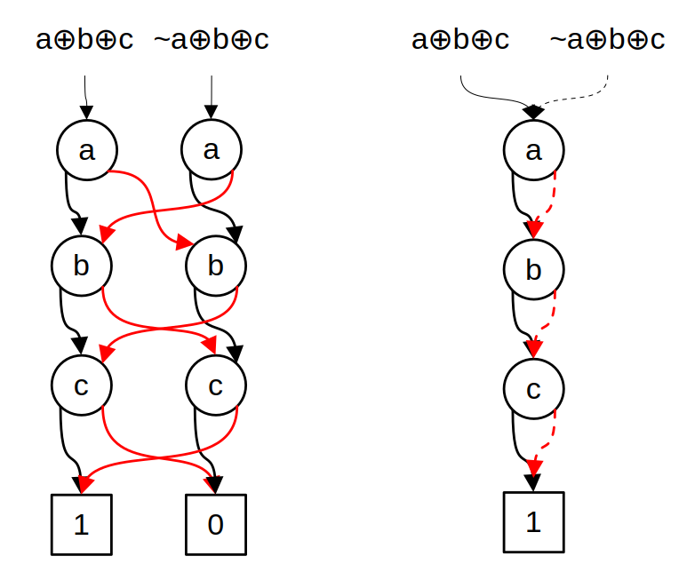

[](https://opensource.org/licenses/MIT)
# abide - Another Binary Decision Diagram Package
## Introduction
Abide is another binary decision diagram ([BDD](https://en.wikipedia.org/wiki/Binary_decision_diagram)) [^Bry]) 
package similar to [CUDD](https://github.com/ivmai/cudd) and [BuDDy](https://github.com/blevinn/buddy-archive). 
It was originally written in C for my Ph.D. research at Yale University in the early 1990s and was a fairly 
faithful implementation of Brace, Rudell and Bryant [^BRB] with Rudell's sifting algorithm added for variable 
reordering [^Rud]. Beginning in 2024, I revisited the code and have made some major changes:
- Large portions have been rewritten in C++.
- The _ite()_ algorithm has been largely replaced by dedicated algorithms for computing the _and_ and _xor_ functions.
  The _ite()_ algorithm is used for functional composition only.
- The reference to a BDD node is now a 32-bit integer rather than a pointer which is 64-bits on current
  architectures.
- Several utility functions have been added that provide useful functionality. These are written using the external C++
  interface and may be used as examples.
  - findProduct() - finds a non-trivial product term with a smaller variable support.[^SS]
  - findXor() - finds a non-trivial XOR term with smaller support.[^SS]
  - extractDnf() - Extracts an irredundant disjunctive normal form (_i.e,_sum-of products).[^Min]
- Also, there are two less useful example programs which may be instructional.
  - An n-queens solver.
  - An application with reads a form of the ISCAS-85 benchmarks and builds BDDs for each gate.

## Differences between abide and CUDD and BuDDy
abide, like BuDDy, is a small package. CUDD is comparatively large with a richer API and support for other decision 
diagrams types: _viz._ ADDs and ZDDs. abide and CUDD allow multiple managers to created. Buddy has a single, global manager.
Both abide and BuDDy represent edges as 32-bit integers. In CUDD, edges are pointers
which require 64 bits on modern architectures. This means that the size of a node structure is smaller in abide and BuDDy:
20 bytes versus 32 bytes in CUDD. Both abide and CUDD us complemented edges to represent the negation of a function.
Using complemented edges allows function inversion to be done on $O(1)$ time. It also results in smaller BDDs with fewer 
nodes. Below is a figure showing BDDs for the functions 
$a \oplus b \oplus c$ and $\neg(a \oplus b \oplus c)$ both with and without complemented edges. 
Positive edges are black, negative edges are red, and complemented edges are dashed.



The table below summarizes these differences.

|   | abide | BuDDy | CUDD |
|---|:-----:|:-----:|:----:|
| multiple managers | yes | no | yes |
| edge representation | 32-bit integer | 32-bit integer | pointer |
| node size | 20 bytes | 20 bytes | 32 bytes |
|inversion| $O(1)$ | $O(n)$ | $O(1)$ |

## Installation and Building
There is a minimal `configure` script that is used to specify the destinations of the libraries and header files.
If the script is run without any arguments, then the libraries and header files will be placed in ./lib 
and ./include respectively. Run `./config -h` to see all options.

To build and export the optimized library and headers type
```
cd src
make export
```
The make files current are hard-coded to use g++ with C++-17. Also, the make files look for g++, ar and install 
in the /usr/bin directory.
## Usage
To use abide in your C++ code, include the exported main header and optionally the utility header
```
#include "Bdd.h"
#include "BddUtils.h" // Optional utility functions.
```

You can create a manager simply by declaring it.
```
BddMgr mgr;
```

Simple literal functions are created using `BddMgr::getLit(BddLit)`.
```
Bdd a = mgr.getLit(1);
Bdd b = mgr.getLit(2);
Bdd bnot = mgr.getLit(-2);
Bdd c = mgr.getLit(4);
Bdd d = mgr.getLit(3);
```
The argument type, `BddLit`, is a signed number. The absolute value of the argument is the variable's _name_. Unless variable reordering is 
performed, the name is also the variable's place in the variable order. 

You can also create constant functions.
```
Bdd zero = mgr.getZero();
Bdd one = mgr.getOne();
```

There are operator overloads for performing Boolean operations and comparing functions.
```
Bdd f = a * b;
Bdd g = ~a * ~b;
Bdd h = a ^ b;
assert(h == f + g);
assert(f <= h);
```

 Of special note is the restriction operator `/` which performs the cofactor operation. This is implemented as the 
 generalized cofactor of Coudert _et al._[^CBM]. If the second operand is a product of literals, this is the same as the 
 Shannon cofactor.
 ```
f = a *b + ~a * c;
assert(f/c == ~a + b);
```

See [Bdd.h](src/Bdd.h) for the full API and [BddUtils.h](src/BddUtils.h) for the utility functions.

[^Bry]: Bryant, "Graph-based algorithms for Boolean function manipulation," in IEEE Transactions on 
Computers, vol. C-35, no. 8, pp. 677-691, Aug. 1986.

[^BRB]: K. S. Brace, R. L. Rudell and R. E. Bryant, "Efficient implementation of a BDD package," 
27th ACM/IEEE Design Automation Conference, Orlando, FL, USA, 1990, pp. 40-45.

[^Rud]: R. Rudell, "Dynamic variable ordering for ordered binary decision diagrams," Proceedings of 1993 
International Conference on Computer Aided Design (ICCAD), Santa Clara, CA, USA, 1993, pp. 42-47

[^SS]: T. Stanion and C. Sechen, "Quasi-algebraic decompositions of switching functions," Proceedings 
Sixteenth Conference on Advanced Research in VLSI, Chapel Hill, NC, USA, 1995, pp. 358-367.

[^Min]: S. Minato, "Fast generation of prime-irredundant covers from binary decision diagrams," IEICE
Trans. Fundamentals, Vol. E76-A, No. 6, pp. 967-973, June 1993.

[^CBM]: O. Coudert, C. Berthet, and J. C. Madre. "Verification of synchronous sequential machines based on symbolic execution,"
Proceedings of the International Workshop on Automatic Verification Methods for Finite State Systems, Springer-Verlag, Berlin, 
Heidelberg, pp. 365–373, 1990.
